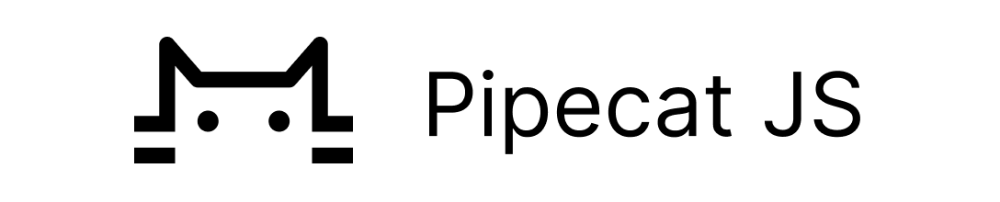

<h1><div align="center">
 
</div></h1>

[](https://docs.pipecat.ai/client/introduction)


## Install

```bash
yarn add @pipecat-ai/client-js
# or
npm install @pipecat-ai/client-js
```

## Quick Start

Instantiate a `RTVIClient` instance, wire up the bot's audio, and start the conversation:

```ts
import { RTVIEvent, RTVIMessage, RTVIClient } from "@pipecat-ai/client-js";
import { DailyTransport } from "@pipecat-ai/daily-transport";

const dailyTransport = new DailyTransport();

const rtviClient = new RTVIClient({
  transport: dailyTransport,
  params: {
    baseUrl: "https://your-connect-end-point-here",
    services: {
      llm: "together",
      tts: "cartesia",
    },
    config: [
      {
        service: "tts",
        options: [
          { name: "voice", value: "79a125e8-cd45-4c13-8a67-188112f4dd22" },
        ],
      },
      {
        service: "llm",
        options: [
          {
            name: "model",
            value: "meta-llama/Meta-Llama-3.1-8B-Instruct-Turbo",
          },
          {
            name: "messages",
            value: [
              {
                role: "system",
                content:
                  "You are a assistant called ExampleBot. You can ask me anything. Keep responses brief and legible. Your responses will be converted to audio, so please avoid using any special characters except '!' or '?'.",
              },
            ],
          },
        ],
      },
    ],
  },
  enableMic: true,
  enableCam: false,
  timeout: 15 * 1000,
  callbacks: {
    onConnected: () => {
      console.log("[CALLBACK] User connected");
    },
    onDisconnected: () => {
      console.log("[CALLBACK] User disconnected");
    },
    onTransportStateChanged: (state: string) => {
      console.log("[CALLBACK] State change:", state);
    },
    onBotConnected: () => {
      console.log("[CALLBACK] Bot connected");
    },
    onBotDisconnected: () => {
      console.log("[CALLBACK] Bot disconnected");
    },
    onBotReady: () => {
      console.log("[CALLBACK] Bot ready to chat!");
    },
  },
});

try {
  await rtviClient.connect();
} catch (e) {
  console.error(e.message);
}

// Events
rtviClient.on(RTVIEvent.TransportStateChanged, (state) => {
  console.log("[EVENT] Transport state change:", state);
});
rtviClient.on(RTVIEvent.BotReady, () => {
  console.log("[EVENT] Bot is ready");
});
rtviClient.on(RTVIEvent.Connected, () => {
  console.log("[EVENT] User connected");
});
rtviClient.on(RTVIEvent.Disconnected, () => {
  console.log("[EVENT] User disconnected");
});
```

## API

Please see API reference [here](https://docs.pipecat.ai/client/reference/js/introduction).
